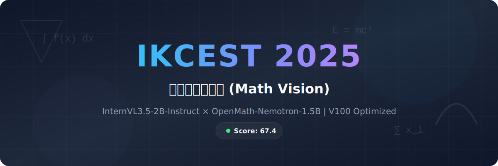

<div align="center">
  
</div>

**2025 西安交通大学数据竞赛 · 数学题图像理解 · 完整方案**


---

## 赛题概述

给定一张数学题的照片（手机拍摄），自动识别题目内容并输出正确答案。


| 题型    | 输出格式    | 示例         |
| ----- | ------- | ---------- |
| 选择题   | 单个选项字母  | `B`        |
| 填空题   | 六位小数浮点数 | `3.141593` |
| 计算应用题 | 六位小数浮点数 | `0.500000` |


> **硬件约束：** 单张 NVIDIA V100-32GB GPU，需在限定时间内完成全部题目推理。

---

## 核心思路：分而治之

> *把一个大问题拆成三个小问题，让最合适的模型去做最擅长的事。*

传统方案用单个 VL 模型端到端处理所有题目（baseline 得分 60.5~65.1），但受限于 V100 显存，模型参数量有上限。我们的思路是：

1. **先用 VL 模型做 OCR**：提取题目文本 + 判断是否含图表
2. **纯文字题交给专业数学模型**：参数虽小但数学推理更强
3. **含图表的题继续用 VL 模型**：需要理解图形信息

```
                    ┌──────────────────────────────────────────────────────────┐
                    │                                                          │
   ┌──────────┐    │    ┌─────────┐         ┌──────────────────┐              │
   │          │    │    │         │  无图表  │  OpenMath-        │              │
   │  输入    │────┼───▶│  OCR    │────────▶│  Nemotron-1.5B   │──┐           │
   │  图像    │    │    │  识别   │         │  (文本数学推理)    │  │           │
   │          │    │    │         │         └──────────────────┘  │  ┌──────┐ │
   └──────────┘    │    │ InternVL│                               ├─▶│      │ │
                    │    │ 3.5-2B  │         ┌──────────────────┐  │  │ 合并 │ │
                    │    │         │  有图表  │  InternVL3.5-2B  │  │  │ 输出 │ │
                    │    │         │────────▶│  (视觉数学推理)    │──┘  │      │ │
                    │    └─────────┘         └──────────────────┘     └──────┘ │
                    │                                                          │
                    │     阶段 1               阶段 2 / 3              结果     │
                    └──────────────────────────────────────────────────────────┘
```


| 角色 | 模型 | 参数量 | HuggingFace |
|:----:|:----:|:------:|:-----------:|
| OCR + 视觉推理 | InternVL3-2B-Instruct | 2B | [`OpenGVLab/InternVL3-2B-Instruct`](https://huggingface.co/OpenGVLab/InternVL3-2B-Instruct) |
| 纯文本数学推理 | OpenMath-Nemotron-1.5B | 1.5B | [`nvidia/OpenMath-Nemotron-1.5B`](https://huggingface.co/nvidia/OpenMath-Nemotron-1.5B) |


两个模型**串行加载/释放**，显存峰值不超过 V100-32GB。

---

## 项目结构

```
xjtu2025-math/
│
├── inference/                      # 竞赛提交 · 核心推理代码
│   ├── run.py                      #   三阶段流程入口
│   ├── run.sh                      #   一键运行脚本（含 V100 环境变量）
│   ├── ocr.py                      #   阶段1 · OCR 识别 + 图表检测
│   ├── text.py                     #   阶段2 · 文本模型批量推理
│   ├── vl.py                       #   阶段3 · 视觉模型批量推理
│   ├── chart_detector.py           #   图表检测器（关键词置信度评分）
│   ├── prompt.py                   #   提示词管理（按题型×模型分发）
│   ├── answer.py                   #   答案提取（math_verify + 多重正则）
│   ├── requirements.txt            #   Python 依赖
│   └── build_env.sh                #   环境安装脚本
│
├── training/                       # 训练代码
│   ├── orm.py                      #   GRPO 奖励函数（格式+正确性+长度）
│   ├── preprocess_dataset.py       #   SFT → GRPO 数据格式转换
│   ├── sft.sh                      #   SFT 训练（8GPU · ZeRO-3 · 冻结ViT）
│   ├── train_grpo.sh               #   GRPO 训练（6GPU + 2GPU vLLM）
│   └── start_vllm.sh               #   vLLM rollout 推理服务
│
├── data_generation/                # 数据合成流水线
│   ├── offline_inference.py        #   大模型批量推理（生成 SFT 数据）
│   ├── verify_answers.py           #   LLM 答案验证（CONSISTENT/INCONSISTENT）
│   ├── filter_consistent.py        #   过滤验证一致样本
│   ├── convert_format.py           #   推理输出 → SFT messages 格式
│   ├── merge_dataset.py            #   多源数据集合并 + 提示词模板
│   └── gt/
│       └── image_effects.py        #   图像特效（光晕·噪声·亮度模拟拍摄）
│
├── evaluation/                     # 评估工具
│   └── score.py                    #   按题型统计准确率
│
├── baselines/                      # 历史方案（对比参考）
│   └── qwen_vl_single_model/       #   单 VL 模型 baseline（60.5~65.1 分）
│
└── assets/
    ├── logo.svg                    #   项目头图
    ├── benchmark_contest.png       #   竞赛官方数据集对比图
    └── benchmark_selfbuilt.png     #   自建测试集对比图
```

> 注：截图文件名已统一为 `benchmark_contest.png` 与 `benchmark_selfbuilt.png`。

---

## 快速开始

### 1. 安装依赖

```bash
cd inference
pip install -r requirements.txt
```

### 2. 下载模型

**推理所需模型（必选）：**

| 模型 | HuggingFace 地址 | 本地目录名 |
|:----:|:----------------:|:----------:|
| InternVL3-2B-Instruct | [`OpenGVLab/InternVL3-2B-Instruct`](https://huggingface.co/OpenGVLab/InternVL3-2B-Instruct) | `InternVL3_5-2B-Instruct/` |
| OpenMath-Nemotron-1.5B | [`nvidia/OpenMath-Nemotron-1.5B`](https://huggingface.co/nvidia/OpenMath-Nemotron-1.5B) | `OpenMath-Nemotron-1.5B/` |

```bash
cd inference

# 方式一：huggingface-cli（推荐）
huggingface-cli download OpenGVLab/InternVL3-2B-Instruct --local-dir ./InternVL3_5-2B-Instruct
huggingface-cli download nvidia/OpenMath-Nemotron-1.5B --local-dir ./OpenMath-Nemotron-1.5B

# 方式二：git clone
git lfs install
git clone https://huggingface.co/OpenGVLab/InternVL3-2B-Instruct ./InternVL3_5-2B-Instruct
git clone https://huggingface.co/nvidia/OpenMath-Nemotron-1.5B ./OpenMath-Nemotron-1.5B
```

**训练/数据合成所需模型（可选）：**

| 模型 | HuggingFace 地址 | 用途 |
|:----:|:----------------:|:----:|
| Qwen2.5-VL-3B-Instruct | [`Qwen/Qwen2.5-VL-3B-Instruct`](https://huggingface.co/Qwen/Qwen2.5-VL-3B-Instruct) | SFT / GRPO 训练基座 |
| Qwen3-VL-235B-A22B-Thinking-AWQ | [`Qwen/Qwen3-VL-235B-A22B-Instruct-AWQ`](https://huggingface.co/Qwen/Qwen3-VL-235B-A22B-Instruct-AWQ) | 数据合成（需 8×GPU） |

最终目录结构：

```
inference/
├── InternVL3_5-2B-Instruct/    # OCR + 视觉推理
└── OpenMath-Nemotron-1.5B/     # 文本数学推理
```

### 3. 运行

**一键运行（竞赛环境）：**

```bash
cd inference
export IMAGE_INPUT_DIR=/path/to/images
export QUERY_PATH=/path/to/input.jsonl
export OUPUT_PATH=./output.jsonl
bash run.sh
```

**分阶段调试：**

```bash
# 阶段1 — OCR 识别 + 图表检测
python run.py stage1 ./data/images ./data/input.jsonl ./ocr_result.jsonl

# 阶段2 — 文本模型推理（无图表题）
python run.py stage2 ./data/images ./ocr_result.jsonl ./text_result.jsonl

# 阶段3 — 视觉模型推理（有图表题）+ 合并
python run.py stage3 ./data/images ./ocr_result.jsonl ./text_result.jsonl ./output.jsonl
```

### 输入 / 输出格式

```jsonc
// 输入 (JSONL)
{"id": 1, "image": "001.jpg", "tag": "选择题"}
{"id": 2, "image": "002.jpg", "tag": "填空题"}

// 输出 (JSONL)
{"id": 1, "image": "001.jpg", "answer": "B"}
{"id": 2, "image": "002.jpg", "answer": "3.141593"}
```

---

## 关键技术详解

### 图表检测

OCR 文本提取后，通过**关键词置信度评分**决定题目是否含图表（决定走文本模型还是视觉模型）：


| 检测维度     | 关键词示例        | 权重         |
| -------- | ------------ | ---------- |
| 图表关键词    | 图、坐标、函数图像、曲线 | +0.30      |
| 图形引用     | 如图所示、由图可知    | +0.30      |
| 测量术语     | 面积、体积、半径、角度  | +0.20      |
| 几何图形     | 三角形、长方体、圆柱   | +0.15      |
| **判定阈值** |              | **≥ 0.30** |


### 答案提取

从模型输出中提取标准化答案，**四级降级策略**：

```
\boxed{} 正则提取
    ↓ 失败
math_verify.parse() → SymPy evalf() → 6位小数
    ↓ 失败
分数字符串解析 (如 "1/3" → "0.333333")
    ↓ 失败
兜底默认答案 (选择题→C, 数值题→1.000000)
```

### V100 显存优化

V100 不支持 Flash Attention 2，需要特殊配置：

```bash
export VLLM_USE_V1=0                        # V0 引擎更稳定
export VLLM_ATTENTION_BACKEND=XFORMERS      # 替代 Flash Attention
export VLLM_USE_TRITON_FLASH_ATTN=0         # 禁用 Triton Flash Attn
export VLLM_TORCH_COMPILE_LEVEL=0           # 禁用 torch.compile
export PYTORCH_CUDA_ALLOC_CONF=expandable_segments:True
```

三阶段**串行执行**，每阶段结束后调用 `gc.collect()` + `torch.cuda.empty_cache()` 彻底释放显存。推理时分 4 批处理，进一步降低峰值显存。

---

## 训练流程

整个训练分为 **数据合成 → SFT → GRPO** 三步：

```
                数据合成                        训练
┌─────────────────────────────────┐   ┌──────────────────────┐
│                                 │   │                      │
│  题目图像 ──▶ Qwen3-VL-235B    │   │  SFT (8 GPU)         │
│              (AWQ 量化, 8GPU)   │   │  ├ DeepSpeed ZeRO-3  │
│              ↓                  │   │  ├ 冻结 ViT          │
│         modelprint              │   │  └ lr=1e-6, 1.5 epoch│
│              ↓                  │   │         ↓             │
│  LLM 答案验证 ──▶ filter       │   │  GRPO (6+2 GPU)      │
│              ↓                  │   │  ├ 自定义 ORM        │
│  SFT messages 格式              │   │  ├ 4 rollout         │
│                                 │   │  └ lr=1e-5, 0.5 epoch│
└─────────────────────────────────┘   └──────────────────────┘
```

### GRPO 奖励函数 (`training/orm.py`)


| 检查维度          | 通过奖励      | 失败惩罚        | 说明               |
| ------------- | --------- | ----------- | ---------------- |
| `<think>` 非空  | +0.30     | −0.80       | 必须展示推理过程         |
| think 长度合理    | +0.30     | −0.20~−0.50 | 4000~9016 tokens |
| `\boxed{}` 格式 | +0.20     | −0.50       | 必须用标准格式          |
| 答案正确性         | **+1.00** | −0.20       | math_verify 符号验证 |
| 总长度控制         | +0.15     | −0.80       | < 11800 tokens   |


---

## 数据来源


| 数据集           | 用途                | 链接                                                                  |
| ------------- | ----------------- | ------------------------------------------------------------------- |
| LIMO          | 高质量数学数据，渲染为题目图像   | [GitHub](https://github.com/GAIR-NLP/LIMO)                          |
| DeepMath-103K | TeX 格式数学题，筛选可转换子集 | [HuggingFace](https://huggingface.co/datasets/zwhe99/DeepMath-103K) |
| MMK12         | 中文数学题，含选择题/填空题    | [HuggingFace](https://huggingface.co/datasets/FanqingM/MMK12)       |


合成时使用 `data_generation/gt/image_effects.py` 添加光晕、噪声等效果，模拟真实手机拍摄环境。

---

## 实验结果

### 竞赛官方闭合测试集


在竞赛官方闭合数据集上，我们的方案（1.54B + 2.35B 双小模型）以 **67.4%** 的准确率取得 **TOP 6**，相比 Qwen2.5-VL-3B baseline 提升 **23.7%**。数据清洗（Input Image Cleaned）带来了额外 5.8% 的提升（61.6% → 67.4%）。

### 自建测试集 Benchmark


在自建测试集上，我们的方案达到 **79.5%** 准确率，**超越 Qwen2.5-VL-32B（72.5%）**——一个参数量是我们 8 倍的模型。相比 3B baseline（45.4%），提升幅度达到 **34.1%**。这证明了「分而治之」策略的巨大优势：用对的模型做对的事，比盲目堆参数量更有效。

---

## 版本迭代与得分


| 版本           | 方案描述                                 | 得分       |
| ------------ | ------------------------------------ | -------- |
| baseline     | Qwen2.5-VL-3B 单模型直接推理                | 60.5     |
| v2           | + 提示词优化 (CoT)                        | 65.1     |
| v3           | + 答案提取优化 (math_verify)               | 64.6     |
| v4 (SFT)     | Qwen2.5-VL-3B + SFT 微调               | 55.7     |
| **v5 (本方案)** | **InternVL3.5-2B + OpenMath 三阶段流水线** | **67.4** |


> **经验教训：** SFT 微调 3B 模型反而降分（v4: 55.7），说明小模型更需要好的推理策略而非盲目微调。最终方案通过「分而治之」的工程策略，让小模型各司其职，取得了最佳效果。

---

## 环境要求


| 依赖           | 版本               |
| ------------ | ---------------- |
| Python       | >= 3.8           |
| vLLM         | 0.10.2           |
| Transformers | 4.56.2           |
| math_verify  | latest           |
| PyTorch      | >= 2.0           |
| GPU          | NVIDIA V100-32GB |


完整依赖见 `[inference/requirements.txt](inference/requirements.txt)`。

---

## License

[MIT License](LICENSE)